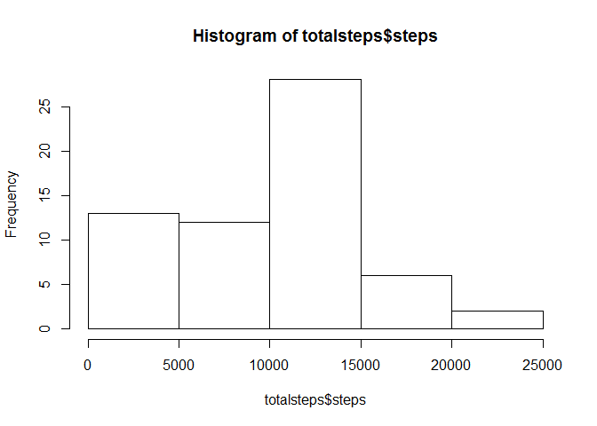
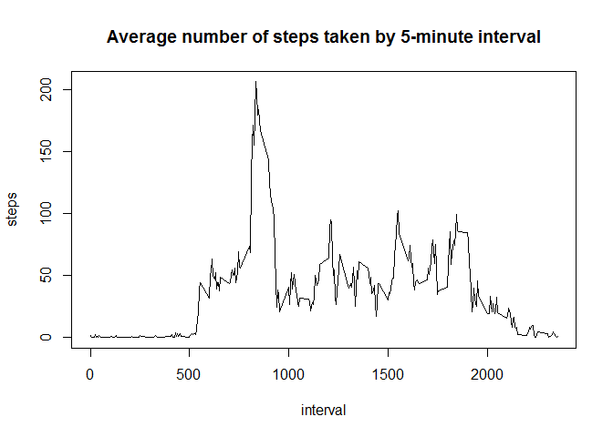
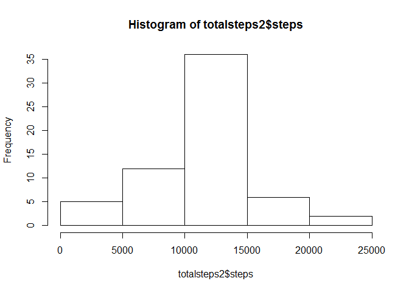
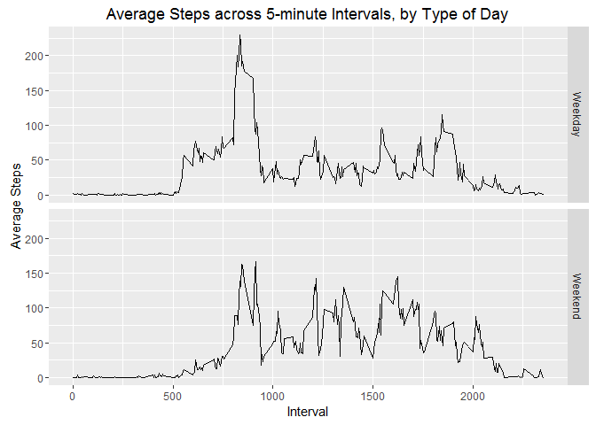

Activity Monitoring Data Analysis
=================================
## Setting global options

In line with asignment requirements, all code chunks have been set to echo. This is not strictly necessary, as echoing is the default.


## Loading and preprocessing the data

The data is read in, and the date column is converted to POSIX class.


```r
activity <- read.csv("activity.csv", na.strings = "NA")
library(lubridate)
```

```
## Warning: package 'lubridate' was built under R version 3.3.2
```

```
## 
## Attaching package: 'lubridate'
```

```
## The following object is masked from 'package:base':
## 
##     date
```

```r
activity$date <- ymd(activity$date)
```

## What is the mean total number of steps taken per day?

First, the activity data is aggregated by day.


```r
# Aggregate the data by date

totalsteps <- aggregate(activity$steps, by = list(day = activity$date), FUN = sum, na.rm = TRUE)
names(totalsteps)[[2]] <- "steps"
```

The total number of steps per day is plotted as a histogram, and the summary statistics (including the mean) are reported.


```r
hist(totalsteps$steps)
```

<!-- -->

```r
summary(totalsteps$steps)
```

```
##    Min. 1st Qu.  Median    Mean 3rd Qu.    Max. 
##       0    6778   10400    9354   12810   21190
```

## What is the average daily activity pattern?

Average the activity data by interval:


```r
interval <- aggregate(activity$steps, by = list(interval = activity$interval), FUN = mean, na.rm = TRUE)
names(interval)[[2]] <- "steps"
```

Average number of steps by interval is plotted as a line graph, and the interval with the highest number of steps is returned.


```r
with(interval, plot(interval, steps, type = "l", main = "Average number of steps taken by 5-minute interval"))
```

<!-- -->

```r
interval[interval$steps == max(interval$steps), 1]
```

```
## [1] 835
```

## Imputing missing values

Calculate and report the total numer of missing values in the dataset:


```r
sum(complete.cases(activity))
```

```
## [1] 15264
```

I've chosen to impute NAs with the mean of their respective intervals:


```r
library(dplyr)
```

```
## 
## Attaching package: 'dplyr'
```

```
## The following objects are masked from 'package:lubridate':
## 
##     intersect, setdiff, union
```

```
## The following objects are masked from 'package:stats':
## 
##     filter, lag
```

```
## The following objects are masked from 'package:base':
## 
##     intersect, setdiff, setequal, union
```

```r
activity2 <- activity %>%
        group_by(interval) %>%
        mutate(steps = replace(steps, is.na(steps), mean(steps, na.rm = TRUE)))
```

Aggregate the data by day:


```r
totalsteps2 <- aggregate(activity2$steps, by = list(day = activity2$date), FUN = sum)
names(totalsteps2)[[2]] <- "steps"
```

The imputed dataset is plotted using a histogram, and the summary statistics are reported.


```r
hist(totalsteps2$steps)
```

<!-- -->

```r
summary(totalsteps2$steps)
```

```
##    Min. 1st Qu.  Median    Mean 3rd Qu.    Max. 
##      41    9819   10770   10770   12810   21190
```

The mean of the imputed dataset is slightly higher than the first part of the assignment. This is because days with missing observations are moved from the lowest bucket to the middle bucket of the histogram.

## Are there differences in activity patterns between weekdays and weekends?

Create a factor variable indivating whether a given date is a weekday or weekend:


```r
activity2 <- mutate(activity2, daycat = factor(1*(weekdays(date) == "Saturday" | weekdays(date) == "Sunday"), labels = c("Weekday", "Weekend")))
```

The data is aggregated by both interval and day type, to facilitate the later panel plot.


```r
weekdayInterval <- aggregate(activity2$steps, by = list(interval = activity2$interval, daycat = activity2$daycat), FUN = mean)
names(weekdayInterval)[[3]] <- "steps"
```

Create a panel plot for average steps in each interval, by type of day:


```r
library(ggplot2)
ggplot(weekdayInterval, aes(interval, steps)) +
        geom_line() +
        facet_grid(daycat ~ .) +
        labs(title = "Average Steps across 5-minute Intervals, by Type of Day",
             x = "Interval", y = "Average Steps")
```

<!-- -->
